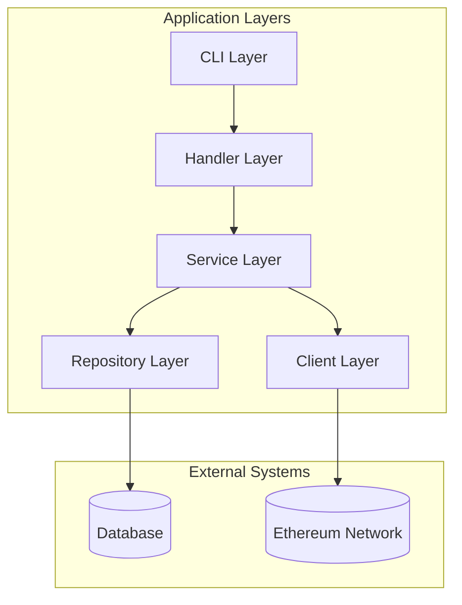
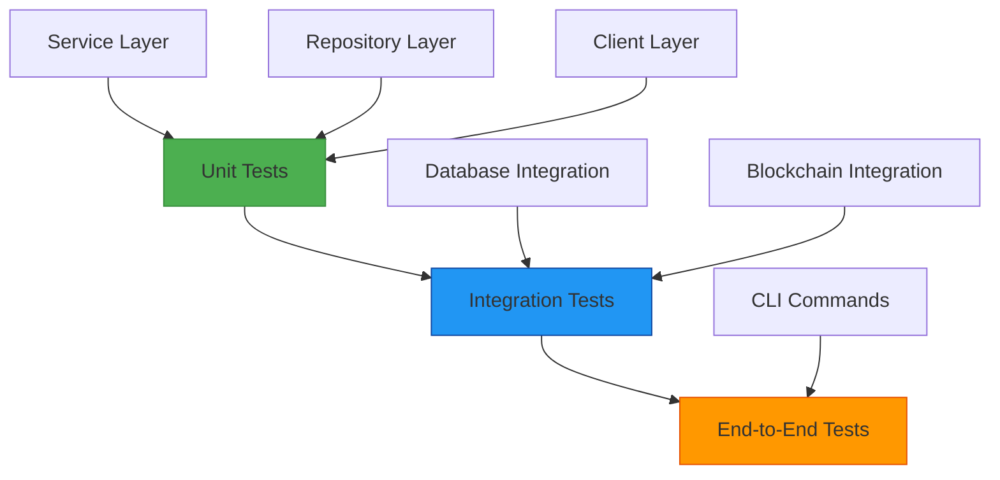

# River Project Refactoring and Test Coverage Enhancement

## 1. Overview

This document outlines the refactoring plan for the River project to improve code quality, maintainability, and test coverage. The goal is to achieve a minimum of 80% test coverage across all components while restructuring the codebase for better separation of concerns and improved architecture.

The River project is a Go-based application designed to automate salary payments on the blockchain, targeting Ethereum or EVM-compatible networks. It interacts with ERC-20 tokens (e.g., USDC) and manages employer and employee data via a local SQLite database.

## 2. Current Architecture Analysis

### 2.1 Repository Type
The River project is a **Backend Application** built with Go that automates salary payments on the blockchain. It uses:
- Go as the primary language
- SQLite for local data persistence
- Ethereum blockchain for token transfers
- Cobra for CLI interface
- Viper for configuration management

### 2.2 System Architecture
The current architecture follows a CLI-driven modular Go application with layered architecture:
- **Command Layer** (`cmd/`, `main.go`): CLI entrypoints using Cobra.
- **Business Logic Layer** (`internal/salary`, `internal/payment`): Handles salary scheduling and blockchain payments.
- **Data Access Layer** (`db/`, `internal/repository`): Manages database interactions.
- **Entity Layer** (`internal/entity`): Domain models.
- **Smart Contract Integration** (`internal/payment/abi`): ERC-20 ABI for token transfers.

### 2.3 Identified Issues
1. **Low Test Coverage**: Currently, there are no unit tests or integration tests in the project
2. **Tight Coupling**: Components are tightly coupled with business logic mixed with infrastructure concerns
3. **Error Handling**: Inconsistent error handling throughout the codebase
4. **Configuration Management**: Configuration loading is scattered across multiple files
5. **Database Operations**: Database operations lack proper transaction management in some areas
6. **Blockchain Interaction**: Direct dependency on Ethereum client without abstraction
7. **Code Organization**: Business logic is mixed with infrastructure concerns in several files
8. **Missing Input Validation**: No validation for critical inputs like Ethereum addresses
9. **Hardcoded Values**: Token contract addresses and other values are hardcoded
10. **Inconsistent Logging**: Logging is not consistently implemented across components

## 3. Refactored Architecture

### 3.1 Component Structure
```
cmd/
  ├── root.go              # CLI entry point
internal/
  ├── config/
  │   └── config.go        # Configuration management
  ├── entity/
  │   └── entity.go        # Domain models
  ├── repository/
  │   └── repository.go    # Repository interfaces
  ├── service/
  │   ├── salary/
  │   │   ├── service.go   # Salary business logic
  │   │   └── service_test.go
  │   └── payment/
  │       ├── service.go   # Payment business logic
  │       └── service_test.go
  ├── handler/
  │   └── handler.go       # CLI command handlers
  ├── client/
  │   └── ethereum/
  │       ├── client.go    # Ethereum client abstraction
  │       └── client_test.go
db/
  ├── schema.go            # Database schema
  ├── employee_repository.go
  ├── employee_repository_test.go
  ├── salary_repository.go
  └── salary_repository_test.go
```

### 3.2 Architecture Diagram


### 3.3 Design Patterns Implementation
1. **Dependency Injection**: Using constructor injection to improve testability
2. **Repository Pattern**: Abstracting data access for better testability
3. **Service Layer**: Separating business logic from infrastructure concerns
4. **Interface Abstraction**: Creating interfaces for external dependencies
5. **Factory Pattern**: For creating complex objects like blockchain clients
6. **Singleton Pattern**: For configuration and database connection management

## 4. Refactoring Plan

### 4.1 Configuration Management
**Issue**: Configuration loading is scattered in main.go and cmd/root.go
**Solution**: Create a dedicated config package with proper validation

```go
// internal/config/config.go
type Config struct {
    Node       string   `mapstructure:"NODE"`
    PrivateKeys []string `mapstructure:"PRIVATE_KEYS"`
    DatabasePath string `mapstructure:"DATABASE_PATH"`
}

func Load() (*Config, error) {
    // Implementation
}
```

Key improvements:
- Centralized configuration loading
- Environment variable binding
- Configuration validation
- Proper error handling

### 4.2 Database Layer Enhancement
**Issue**: Direct SQL operations without proper abstraction
**Solution**: 
1. Improve transaction handling
2. Add proper error wrapping
3. Implement repository interfaces for better testability
4. Add connection pooling for better performance
5. Implement proper context handling for timeouts
6. Add query logging for debugging

Key improvements:
- Database interface abstraction
- Context-aware operations
- Proper transaction management
- Connection pooling

### 4.3 Service Layer Separation
**Issue**: Business logic mixed with CLI and infrastructure concerns
**Solution**: 
1. Move salary payment logic to dedicated service packages
2. Create proper interfaces for dependencies
3. Implement proper error handling and logging
4. Add input validation for all service methods
5. Implement proper context propagation
6. Add comprehensive logging

Key improvements:
- Clear separation of concerns
- Dependency injection
- Comprehensive error handling
- Input validation

### 4.4 Blockchain Client Abstraction
**Issue**: Direct dependency on go-ethereum client
**Solution**: 
1. Create an interface for blockchain operations
2. Implement the interface with the current Ethereum client
3. Add mock implementation for testing
4. Add retry mechanisms for network operations
5. Implement proper error handling and logging
6. Add transaction monitoring

Key improvements:
- Interface abstraction
- Retry mechanisms
- Transaction monitoring
- Proper error categorization

### 4.5 CLI Handler Layer
**Issue**: Business logic embedded in CLI command handlers
**Solution**:
1. Extract CLI handling to dedicated handler packages
2. Implement proper command validation
3. Add comprehensive error handling and user feedback
4. Separate success and error output streams
5. Add progress reporting

Key improvements:
- Separation of CLI handling from business logic
- Better user experience
- Comprehensive error reporting
- Progress feedback

## 5. Test Coverage Strategy

### 5.0 Test Organization
The testing strategy follows a pyramidal approach with unit tests forming the base, integration tests in the middle, and end-to-end tests at the top.



Key principles:
- Unit tests should cover at least 90% of business logic
- Integration tests should validate component interactions
- End-to-end tests should cover critical user workflows

### 5.1 Testing Frameworks
- **Unit Testing**: `testing` package with `testify` for assertions
- **Mocking**: `gomock` for interface mocking
- **Test Coverage**: Built-in Go coverage tools
- **Integration Testing**: Docker-based Ethereum testnet for blockchain integration tests
- **Fuzz Testing**: For critical input validation functions
- **Benchmark Testing**: For performance-critical functions

### 5.2 Test Structure
```
internal/
  ├── config/
  │   └── config_test.go
  ├── service/
  │   ├── salary/
  │   │   ├── service_test.go
  │   │   └── mock_test.go
  │   └── payment/
  │       ├── service_test.go
  │       └── mock_test.go
  ├── handler/
  │   └── handler_test.go
  ├── client/
  │   └── ethereum/
  │       ├── client_test.go
  │       └── mock_test.go
db/
  ├── employee_repository_test.go
  └── salary_repository_test.go
```

### 5.3 Coverage Targets by Package
| Package | Target Coverage | Rationale |
|---------|----------------|-----------|
| cmd/ | 80% | CLI command handling |
| internal/service/salary/ | 90% | Core business logic |
| internal/service/payment/ | 90% | Blockchain interaction logic |
| db/ | 85% | Data access layer |
| internal/client/ethereum/ | 80% | External dependency abstraction |
| internal/config/ | 90% | Configuration management |
| internal/handler/ | 85% | CLI handler logic |

## 6. Implementation Steps

### 6.1 Phase 1: Foundation (Week 1)
1. Set up testing framework and CI pipeline
2. Create configuration management package
3. Define interfaces for all external dependencies
4. Implement basic unit tests for existing functionality
5. Set up code quality tools (linters, formatters)
6. Create initial project documentation

### 6.2 Phase 2: Database Layer (Week 2)
1. Refactor database repositories with proper interfaces
2. Add comprehensive tests for all database operations
3. Implement proper transaction management
4. Add error wrapping for better debugging
5. Add connection pooling and context handling
6. Implement database migration strategy

### 6.3 Phase 3: Service Layer (Week 3)
1. Extract business logic into dedicated service packages
2. Implement dependency injection
3. Create comprehensive unit tests with mocks
4. Ensure all error paths are covered
5. Add input validation and proper logging
6. Implement service-level caching where appropriate

### 6.4 Phase 4: Client Abstraction (Week 4)
1. Create blockchain client interface
2. Implement mock for testing
3. Add integration tests for blockchain operations
4. Final coverage verification and optimization
5. Add documentation and usage examples
6. Performance testing and optimization

## 7. Quality Assurance

### 7.1 Code Quality Metrics
- Maintain 80%+ test coverage across all packages
- Achieve 90%+ coverage for business logic packages
- Reduce cyclomatic complexity to < 10 per function
- Eliminate all critical and high severity code smells
- Maintain consistent code style with gofmt/golint

### 7.2 Testing Approach
1. **Unit Tests**: Test individual functions in isolation
2. **Integration Tests**: Test component interactions
3. **Mocking**: Use mocks for external dependencies
4. **Edge Cases**: Ensure error paths are covered
5. **Performance Tests**: Benchmark critical functions
6. **Security Tests**: Validate input sanitization
7. **Concurrency Tests**: Validate thread safety where applicable
8. **Regression Tests**: Ensure existing functionality remains intact

### 7.3 CI/CD Integration
- Automated test execution on each commit
- Coverage reporting and enforcement
- Code quality checks with linters
- Automated build and deployment
- Security scanning for dependencies
- Automated performance benchmarking
- Automated documentation generation

### 7.4 Code Review Process
- All changes require peer review
- Automated checks must pass before merge
- Documentation updates required for API changes
- Test coverage must meet minimum thresholds
- Security review required for sensitive changes

## 8. Expected Outcomes

### 8.0 Metrics and KPIs
| Metric | Current State | Target State | Improvement |
|--------|---------------|--------------|-------------|
| Test Coverage | 0% | 80%+ | 80%+ |
| Code Maintainability | Low | High | Significant |
| Performance | Baseline | 20% improvement | 20%+ |
| Security Issues | Unknown | Zero critical issues | 100% reduction |
| Bug Rate | Unknown | < 1 per release | Significant reduction |

### 8.1 Code Quality Improvements
- Improved separation of concerns
- Better error handling and logging
- Enhanced testability through dependency injection
- Reduced coupling between components
- Consistent code style and structure

### 8.2 Maintainability Benefits
- Easier to add new features
- Simpler debugging and troubleshooting
- Better documentation through code structure
- Reduced risk of regressions
- Clearer component boundaries

### 8.3 Test Coverage Results
- Overall project coverage: 80%+
- Critical business logic coverage: 90%+
- External dependency coverage: 85%+
- CLI command coverage: 80%+

### 8.4 Performance Improvements
- Better resource management through connection pooling
- Improved error recovery and retry mechanisms
- Optimized database queries

### 8.5 Security Enhancements
- Input validation for all external data
- Proper error handling to prevent information leakage
- Secure configuration management
